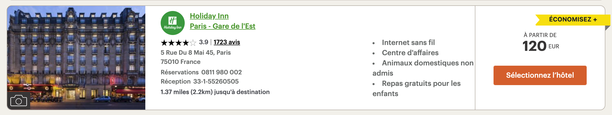
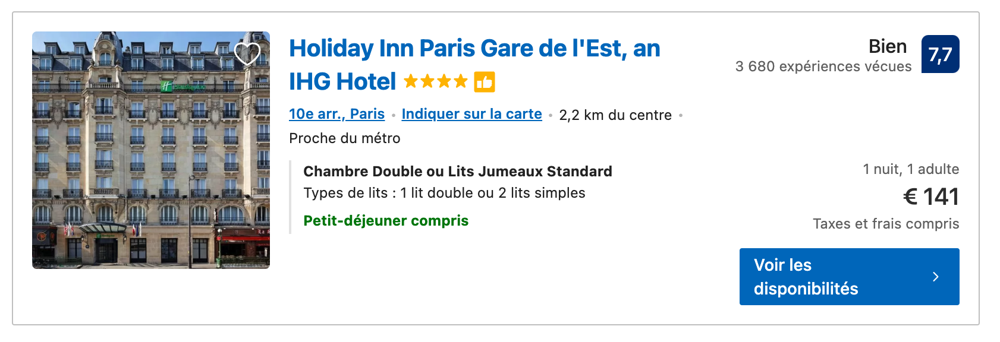

​																										**AirHotel lader**

## Main purpose

As an international student, I have a very strong need to travel. But every time I look for information on hotels and flights, it gives me a huge headache. The quality of hotels on the common OTA sites varied. So after a long period of experimentation, I started to choose some hotel chains and signed up for the frequent flyer programme. In fact this way the prices are often lower than the OTAs too. In terms of flights, low-cost airlines are cheap, but they are also often expensive when you add in baggage. Full service airlines tend to have more expensive airfares themselves, but award tickets often come at some unexpectedly good prices. The current search tools provided by the airlines are not good and smart enough. So I started this project to get some good prices on hotels and airline tickets.

​																		Price comparison between OTA and direct channel

The main methods of implementation include and are not limited to comparing cash prices/points prices, real-time price tracking, etc.

After talking to my classmates, friends and other people, I found out that there are not many people who have also such needs. So I decided to add further GUI to implement interactive (mainly by Django), distributed crawler technology (to improve stability).

## Value of the project

The value of this project is twofold:
For the individual user, it makes it easier to find information on accommodation, flights etc. in the desired conditions. And the addition of price tracking helps him/her to be able to spend less time to find a better price for his/her trip. For small travel agencies and individual agents, this tool makes it easier for them to book itineraries for their customers.
For hotel groups and airlines, this tool helps them to drive traffic and increase the share of direct sales channels.

## Main progress

- 20/11/2022 First version, test api for IHG, airfrance, and Csair.
- 07/12/2022 Add database. realize the function of search cash price, points price of the IHG hotels in specific city.